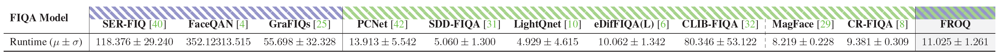

# __FROQ__: Observing Face Recognition Models for Efficient Quality Assessment (*Official Repository*)

- Official repository of the paper "FROQ: Observing Face Recognition Models for Efficient Quality Assessment" in proceedings of the [IEEE International Joint Conference on Biometrics (IJCB) 2025](https://ijcb2025.ieee-biometrics.org/ "IJCB'25 Webpage").

## Table of Contents

- [__FROQ__: Observing Face Recognition Models for Efficient Quality Assessment (*Official Repository*)](#froq-observing-face-recognition-models-for-efficient-quality-assessment-official-repository)
  - [Table of Contents](#table-of-contents)
  - [1. Methodology](#1-methodology)
  - [2. Experimental Results](#2-experimental-results)
    - [2.1 Performance Results](#21-performance-results)
    - [2.2 Runtime Results](#22-runtime-results)
  - [3. Environment Setup](#3-environment-setup)
    - [Create the Conda environment from scratch](#create-the-conda-environment-from-scratch)
  - [4. How-to-Use](#4-how-to-use)
  - [Citation](#citation)


## 1. Methodology


**FROQ** is a *semi‑supervised, training‑free* technique for **Face Image Quality Assessment (FIQA)** that leverages existing face recognition (FR) models for efficient, accurate quality estimation.

- **What it does**:  
  FROQ taps into carefully selected **intermediate representations** (feature activations in specific layers) of a frozen FR model to infer image quality—without any further training or architectural changes.

- **How it works**:  
  1. **Observer Initialization**: A small **calibration set** with pseudo‑quality labels (from a perturbation‑based auxiliary FIQA method) is used to evaluate which layers’ activations correlate best with perceived quality via Spearman’s rank correlation.  
  2. **Layer Selection & Aggregation**: A **greedy selection** identifies the most informative layers. For each selected layer, the **aggregation function** (L₂ norm of flattened activations) converts tensor outputs into scalar scores.  

## 2. Experimental Results

### 2.1 Performance Results

- **Setup**: The evaluation spans **seven public test datasets** and **four pre‑trained face recognition (FR) models**, measuring each FIQA method’s capability to prioritize high-quality samples. Performance is quantified using the **partial area under the ROC curve (pAUC)** at a fixed **false match rate (FMR) of 10⁻³**, with a discard rate of **0.3**—meaning the bottom 30% of samples (by predicted quality) are excluded during evaluation.


- **FROQ** demonstrates strong, competitive performance across all evaluated face image quality benchmarks and FR models.  
- Compared to **state-of-the-art unsupervised methods** (such as SER-FIQ, FaceQAN, GraFIQs), **FROQ consistently outperforms them in terms of pAUC scores at a 20% discard rate**.
- While top supervised methods like eDifFIQA, CLIB-FIQA and CR-FIQA sometimes achieve slightly higher results, FROQ achieves a **favorable balance of efficiency and accuracy**, closely matching or surpassing their average performance—**without the need for dedicated training or model modification**.

> 🟢 **Takeaway:** FROQ delivers state-of-the-art face image quality assessment, combining the simplicity and adaptability of unsupervised methods with the efficiency and reliability typical of supervised approaches—**all with just a single forward pass**.


### 2.2 Runtime Results





- **FROQ** achieves **efficient inference**, processing a single image in about **11 ms**—comparable to leading supervised methods (e.g., MagFace, CR-FIQA) and significantly **faster than all evaluated unsupervised approaches** such as SER-FIQ, FaceQAN, and GraFIQs.
- While a few lightweight supervised models (e.g., LightQNet, SDD-FIQA) are marginally faster, FROQ's runtime is on par with or better than the majority of existing solutions, offering a strong trade-off between speed and performance.

> 🟢 **Takeaway:** FROQ combines high accuracy with low computational cost, making it a practical choice for real-world deployments where both **speed and quality** are crucial.


## 3. Environment Setup


This repository primarily uses **Conda** for environment management.  

### Create the Conda environment from scratch
```bash
conda create -n FROQ python=3.10
conda activate FROQ
```

The dependencies can be installed via **pip**.

```bash
pip install -r requirements.txt
```

The packages used by the repository are (if you wish to install them by hand):

  - torch, torchvision, pillow, tqdm, scipy, numpy, einops, yaml


The code was tested using:
  - __python 3.10__ 
  - __CUDA 2.8__.


## 4. How-to-Use

The repository is segmented into two parts:

  - [**Baseline FIQA**](./baselineFIQA/README.md): contains the code for generating the pseudo quality labels used in the evaluation of the utility of intermediate representations. 

  - [**Observer - FROQ**](./observer/README.md): contains the code for the observer initialization and inference using the FROQ technique.
  
Details of the two individual parts are presented in their respective README files.

Before running the code you have to download the calibration dataset and setup the FR model (AdaFace):

   - Calibration dataset:
  
     1.   Install Git LFS via: 
            ``` 
            sudo apt install git-lfs
            git lfs install
            ```
     2.   Pull the ZIP file via:
          ``` 
          git lfs pull
          ```  
     4.   Unzip the file into the main folder of the repository. __The structure should be ./FROQ/calibration_dataset/id_XXXX/*.jpg__
          ``` 
          unzip calibration_dataset.zip -d calibration_dataset
          ```   
   
   - FR model:

      1. Obtain the pretrained weight from the official repository [[HERE](https://github.com/mk-minchul/AdaFace)].
      2. Rename the checkpoint file **adaface_weight.ckpt**
      3. Place the file in the *./face_recognition_model* folder

If you wish to run the whole pipeline including the auxiliary FIQA technique, observer initialization and quality prediction, use the included shell script:

```bash
./run.sh
```


## Citation

If you find this repository useful, please cite the following paper:

```
 @inproceedings{babnikIJCB2025,
  title={{FROQ: Observing Face Recognition Models for Efficient Quality Assessment}},
  author={Babnik, {\v{Z}}iga and Jain, Deepak Kumar and Peer, Peter and {\v{S}}truc, Vitomir},
  booktitle={Proceedings of the IEEE International Joint Conference on Biometrics (IJCB)},
  year={2025},
}
```